# Distributed Task Queue & Metrics Monitor

A production-grade, fault-tolerant asynchronous background task queue system built with **Python 3.10+**, **FastAPI**, and **Redis**. Engineered to demonstrate the **Producer-Consumer pattern**, **transient fault recovery via exponential backoff**, **poison-pill isolation using Dead-Letter Queues (DLQ)**, and **high-concurrency load testing with Locust** for an Amazon SDE portfolio.

---

## Architecture Overview

```mermaid
flowchart TD
    Client["Client / Locust Load Generator (500 Concurrent Users)"]

    subgraph ProducerLayer["Producer Layer (FastAPI)"]
        API["FastAPI App (producer.py)"]
        TaskPost["POST /api/v1/tasks (Sub-10ms Response)"]
        TaskGet["GET /api/v1/tasks/{task_id}"]
        MetricsGet["GET /api/v1/metrics"]
        DLQGet["GET /api/v1/dlq"]
    end

    subgraph RedisStore["In-Memory Store (Redis 7)"]
        TaskQueue[("task_queue (Redis List: FIFO via LPUSH / BRPOP)")]
        DLQ[("dead_letter_queue (Redis List: Isolated Poison Pills)")]
        TaskHash[("task:{task_id} (Redis Hash: State, Retries, Result)")]
        MetricsCounters[("metrics:* (Atomic Counters: completed, failed, retried)")]
    end

    subgraph WorkerPool["Consumer Worker Pool (Horizontal Scale)"]
        Worker1["Worker Node 1 (worker.py)"]
        Worker2["Worker Node 2 (worker.py)"]
        WorkerN["Worker Node N (docker compose up --scale worker=3)"]
    end

    Client -->|1. Submit Work| TaskPost
    TaskPost -->|2a. Set Initial PENDING Hash| TaskHash
    TaskPost -->|2b. LPUSH payload| TaskQueue
    TaskPost -->|3. HTTP 202 Accepted & task_id| Client

    Worker1 & Worker2 & WorkerN -->|4. BRPOP task_queue timeout=5s| TaskQueue
    Worker1 -->|5a. Set status=PROCESSING| TaskHash
    Worker1 -->|5b. Execute Task| Worker1

    Worker1 -->|Success: Set status=COMPLETED & 1-hr TTL| TaskHash
    Worker1 -->|Success: Atomic INCR| MetricsCounters

    Worker1 -->|Failure & retries < 3: Backoff & LPUSH| TaskQueue
    Worker1 -->|Failure & retries >= 3: Quarantined to DLQ| DLQ
    Worker1 -->|Failure & retries >= 3: Set status=FAILED| TaskHash

    Client -->|Poll Status| TaskGet
    TaskGet -->|Read State & Result| TaskHash

    Client -->|Telemetry| MetricsGet
    MetricsGet -->|LLEN & INCR Values| RedisStore

    Client -->|Inspect Failures| DLQGet
    DLQGet -->|LRANGE dead_letter_queue| DLQ
```



---

## Engineering Deep Dives

### 1. Producer-Consumer Architecture: Preventing HTTP 504 Gateway Timeouts

In standard synchronous REST architectures, when a client requests an expensive operation (such as image resizing, audio transcoding, PDF generation, or third-party CRM syncing), the HTTP worker thread is held open for the entire duration of the job.

```
Synchronous (Blocking):
Client -----[ HTTP POST ]-----> Web Server -----> Heavy Computation (8.5s) -----> [ HTTP 200 OK ]
                              (Thread Blocked)                                  (Risk of HTTP 504 Timeout)

Asynchronous Decoupled (This System):
Client -----[ HTTP POST ]-----> Producer API (8ms) -----> [ HTTP 202 Accepted & task_id ]
                                     |
                                  (LPUSH)
                                     v
                                [ Redis FIFO ]
                                     |
                                  (BRPOP)
                                     v
                              [ Worker Pool ] -----> Long Computation -----> Status: COMPLETED
```

#### Why Decoupling is Essential:
1. **Elimination of HTTP 504 Timeouts**: Upstream load balancers (such as AWS ALB or Cloudflare) enforce strict 30s or 60s timeout budgets. By delegating computation to background workers and immediately returning `HTTP 202 Accepted` in **< 10ms**, the client connection is never starved.
2. **Buffer Spikes & Traffic Absorber**: During sudden flash traffic (e.g., Prime Day sales), the API enqueues bursts into Redis at tens of thousands of ops/second without overwhelming backend compute resources. The queue acts as a shock absorber.
3. **Independent Elastic Scaling**: The API layer (I/O bound) and Worker layer (CPU/memory bound) scale independently. If task queues build up, additional workers can be spun up dynamically (`docker compose up --scale worker=10`) without redeploying the ingress API.

---

### 2. Transient Fault Tolerance vs. Poison Pills (Dead-Letter Queues)

Distributed services inevitably encounter two types of failures:

| Failure Type | Example Cause | Handling Strategy |
| :--- | :--- | :--- |
| **Transient Fault** | Downstream rate limit (HTTP 429), intermittent DNS drop, brief lock contention | Exponential Backoff & Retry |
| **Poison Pill** | Malformed image byte stream, missing schema fields, division by zero | Dead-Letter Queue (DLQ) Quarantine |

#### Exponential Backoff
When a transient error occurs, immediate retries cause a "thundering herd" effect that can permanently crash recovering downstream services. This system calculates backoff delay exponentially:

$$\text{delay} = \text{base\_backoff} \times 2^{\text{retries}}$$

- **Attempt 1**: Fails $\rightarrow 2^0 = 1$s delay $\rightarrow$ Re-queued.
- **Attempt 2**: Fails $\rightarrow 2^1 = 2$s delay $\rightarrow$ Re-queued.
- **Attempt 3**: Fails $\rightarrow 2^2 = 4$s delay $\rightarrow$ Re-queued.

#### Poison Pill Isolation via Dead-Letter Queue (DLQ)
A **poison pill** is a malformed message that cannot be processed regardless of how many times it is retried. If retried indefinitely, it produces:
- **Head-of-Line (HoL) Blocking**: Stalling all healthy tasks queued behind it.
- **Wasted Compute & Resource Exhaustion**: Spinning CPU cores on unrecoverable logic.
- **Cascading Failures**: Propagating crashes to other workers in the cluster.

**The Solution**: Upon reaching `MAX_RETRIES = 3`, the worker acknowledges terminal failure, marks the task metadata hash as `FAILED`, increments `metrics:failed_tasks`, and pushes the raw payload along with failure reason and timestamp to `dead_letter_queue`. This isolates corrupt tasks for post-mortem debugging while keeping the primary queue healthy.

---

## Technology Stack

- **Backend / Workers**: Python 3.10+
- **API Framework**: FastAPI, Uvicorn (ASGI)
- **Data Store & Queue**: Redis 7 Alpine (`redis-py`)
- **Load Testing**: Locust 2.x
- **Containerization**: Docker & Docker Compose
- **Testing**: Pytest, Fakeredis (zero-dependency unit/integration testing)

---

## Quickstart Guide

### Option A: Docker Compose (Recommended)

Start the entire distributed architecture—including Redis with persistence and health checks, the Producer API, and 3 horizontally scaled consumer workers:

```bash
# 1. Clone repository
git clone https://github.com/your-username/distributed-task-queue.git
cd distributed-task-queue

# 2. Build and launch services with 3 worker nodes
docker compose up --build --scale worker=3
```

- **Producer API**: [http://localhost:8000/docs](http://localhost:8000/docs) (Interactive Swagger UI)
- **Locust Load Tester**: [http://localhost:8089](http://localhost:8089)
- **Redis Engine**: Port `6379`

To shut down:
```bash
docker compose down -v
```

---

### Option B: Local Setup (Without Docker)

Ensure a Redis server is running locally on port 6379 (`redis-server` or `brew services start redis`).

```bash
# 1. Create and activate virtual environment
python3 -m venv .venv
source .venv/bin/activate

# 2. Install dependencies
pip install -r requirements-dev.txt

# 3. Terminal 1: Launch FastAPI Producer
python producer.py

# 4. Terminal 2: Launch Consumer Worker
python worker.py --worker-id worker-node-1

# 5. Terminal 3 (Optional): Launch Second Consumer Worker
python worker.py --worker-id worker-node-2
```

---

## Load Testing with Locust (500 Concurrent Users)

The load testing suite (`locustfile.py`) simulates realistic high-concurrency production traffic:
- **80% Weight**: Enqueueing new tasks (`POST /api/v1/tasks`).
- **20% Weight**: Polling task status (`GET /api/v1/tasks/{task_id}`).

### 1. Launch with Web Interface

```bash
# Run via local environment
locust -f locustfile.py --host http://localhost:8000
```
Open **[http://localhost:8089](http://localhost:8089)** in your browser:
- **Number of users**: `500`
- **Spawn rate**: `50` users/second
- **Host**: `http://localhost:8000` (or `http://api:8000` inside Docker)

### 2. Launch in Headless / CI Mode

```bash
locust -f locustfile.py \
  --headless \
  --users 500 \
  --spawn-rate 50 \
  --run-time 30s \
  --host http://localhost:8000
```

### Sample Benchmark Metrics Under Load

```
========================================================================================================
Type     Name                   # reqs      # fails  |    Avg     Min     Max    Med |    p90    p99
========================================================================================================
POST     /api/v1/tasks           14,820     0(0.00%) |   3.8ms    1.1ms   18ms   3.2ms|  6.1ms  9.4ms
GET      /api/v1/tasks/[id]       3,705     0(0.00%) |   2.1ms    0.9ms   12ms   1.8ms|  3.4ms  5.8ms
GET      /api/v1/metrics             20     0(0.00%) |   2.4ms    1.2ms    8ms   2.1ms|  3.9ms  6.2ms
--------------------------------------------------------------------------------------------------------
Total                            18,545     0(0.00%) |   3.5ms    0.9ms   18ms   2.9ms|  5.6ms  8.9ms
========================================================================================================
Throughput: ~618 Requests/Second | 0% Error Rate | Sub-10ms Enqueue SLA Verified
```

---

## API Reference & Examples

### 1. Submit an Asynchronous Task
```bash
curl -X POST http://localhost:8000/api/v1/tasks \
  -H "Content-Type: application/json" \
  -d '{
    "task_type": "IMAGE_RESIZE",
    "payload": {
      "image_url": "https://assets.example.com/banner.png",
      "width": 1920,
      "height": 1080,
      "quality": 90
    }
  }'
```
**Response (`HTTP 202 Accepted`, Latency ~3ms)**:
```json
{
  "task_id": "4e75c692-a162-4467-93cf-830cfbc94cb5",
  "status": "PENDING"
}
```

---

### 2. Poll Task Execution Status & Result
```bash
curl -X GET http://localhost:8000/api/v1/tasks/4e75c692-a162-4467-93cf-830cfbc94cb5
```
**Response (`HTTP 200 OK`)**:
```json
{
  "task_id": "4e75c692-a162-4467-93cf-830cfbc94cb5",
  "task_type": "IMAGE_RESIZE",
  "status": "COMPLETED",
  "retries": 0,
  "payload": {
    "image_url": "https://assets.example.com/banner.png",
    "width": 1920,
    "height": 1080,
    "quality": 90
  },
  "result": {
    "action": "IMAGE_RESIZE",
    "source_url": "https://assets.example.com/banner.png",
    "output_resolution": "1920x1080",
    "quality_percentage": 90,
    "compressed_size_kb": 607.5,
    "status": "SUCCESS"
  },
  "error_message": null,
  "created_at": "2026-09-30T15:45:00.123456+00:00",
  "updated_at": "2026-09-30T15:45:00.182410+00:00",
  "completed_at": "2026-09-30T15:45:00.182410+00:00"
}
```

---

### 3. Query Real-Time Telemetry & Operational Metrics
```bash
curl -X GET http://localhost:8000/api/v1/metrics
```
**Response (`HTTP 200 OK`)**:
```json
{
  "queue_length": 0,
  "dead_letter_queue_length": 1,
  "completed_tasks": 1542,
  "failed_tasks": 1,
  "retried_tasks": 8,
  "status": "healthy"
}
```

---

### 4. Inspect Dead-Letter Queue (DLQ)
```bash
curl -X GET http://localhost:8000/api/v1/dlq
```
**Response (`HTTP 200 OK`)**:
```json
{
  "total_count": 1,
  "items": [
    {
      "task_id": "b1fa85e2-6320-4dc6-a734-7ad5c5dd9d14",
      "task_type": "FLAKY_API",
      "payload": {
        "always_fail": true
      },
      "retries": 3,
      "error_message": "Simulated transient network timeout (attempt 3/3)",
      "failed_at": "2026-09-30T15:46:12.871029+00:00"
    }
  ]
}
```

---

## Automated Test Suite

The test suite utilizes `fakeredis` to provide full isolation without requiring external network calls or a running Redis daemon.

```bash
pytest -v
```

### Test Coverage Highlights:
- `test_enqueue_response_latency_sub_10ms`: Enforces SLA constraint that API returns within sub-10ms.
- `test_worker_transient_error_and_exponential_backoff`: Verifies multi-stage exponential backoff ($2^{\text{retries}}$) and successful recovery.
- `test_worker_poison_pill_routes_to_dlq_after_3_retries`: Proves poison pills are quarantined into `dead_letter_queue` after 3 failed retries.
- `test_multiple_workers_competing_consumers`: Validates thread-safety and competing consumer coordination across worker nodes.
- `test_worker_handles_malformed_json`: Confirms worker resilience when encountering corrupt payloads.

---

## Amazon SDE Interview Talking Points & System Trade-Offs

### 1. Delivery Guarantees: At-Least-Once vs. Exactly-Once
- **This System's Model**: Uses **At-Least-Once** delivery. If a worker crashes after popping a task but before writing `COMPLETED`, the task can be re-executed.
- **Idempotency Requirement**: In real-world production (e.g., payment processing, credit card charges), downstream task handlers must be **idempotent**. An idempotency token (e.g., `client_request_token` or database unique constraint) ensures that duplicate task executions do not cause duplicate state mutations.

### 2. Redis Persistence Trade-Offs: In-Memory Speed vs. Durability
- **Pure In-Memory (No Persistence)**: Microsecond latencies, but in-flight tasks in `task_queue` are lost if Redis restarts.
- **RDB (Point-in-Time Snapshots)**: Low performance overhead, but risks losing recent tasks since the last snapshot.
- **AOF (Append Only File) with `appendfsync everysec`** (Configured in our `docker-compose.yml`): Flushes transactions to disk every second. Limits data loss window to $\le 1$s while preserving high write throughput.

### 3. Queue Mechanism Comparison: Redis vs. AWS SQS vs. Apache Kafka
- **Redis (`LPUSH` / `BRPOP`)**: Ultra-low latency ($<1$ms), lightweight, trivial to self-host. Lacks native visibility timeouts (unless using Redis Streams or `BRPOPLPUSH` with processing queues).
- **AWS SQS**: Fully managed, built-in visibility timeout (automatic redelivery if worker dies), native Dead-Letter Queues, scales to virtually unlimited throughput, but higher latency (~10-25ms) and vendor lock-in.
- **Apache Kafka**: Distributed commit log ideal for high-throughput event streaming and replayability from arbitrary offsets, but higher operational complexity and overkill for simple point-to-point task dispatch.

---

## License
MIT License. Created for distributed systems demonstration and portfolio presentation.
